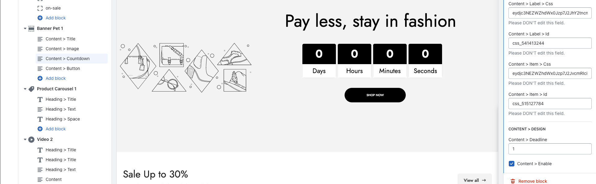
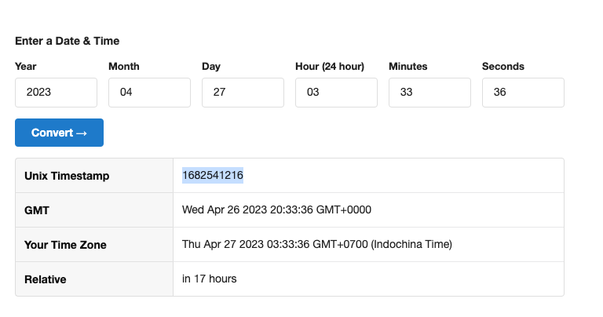

# Countdown Timer cần đổi lại Label

Người chịu trách nhiệm: Đoàn Văn
Người nghiệm thu: Nguyen Dttn
Status: Not started

1. Đổi tên từ Deadline → Countdown Timer @Đoàn Văn 
2. Cần thêm description cho field này:
    
    Click here to convert the ended date to timestamp @Đoàn Văn Link sẽ dẫn đến 1 trang để khách có thể chọn thời gian (dạng human readable ) và tự động convert giá trị đó sang timestamp. 
    
    
    
    Cần làm 1 trang convert ở Codesandbox để người dùng chọn thời gian và sau đó copy timestamp @Tưởng Lê Mạnh